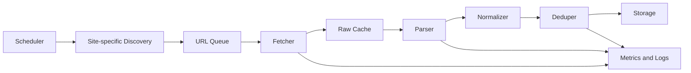
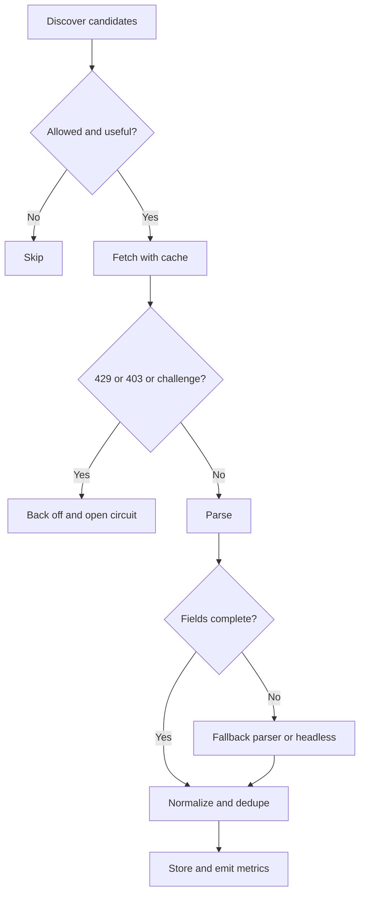

# Best Ways to Fetch News from Forex Factory, Bloomberg, and Yahoo News

## Executive summary

The three sites call for three very different ingestion strategies. For **Bloomberg**, the best answer is **not scraping the consumer website at all**: Bloomberg has official, licensed machine-readable products for market and news workflows, including BLPAPI, Server API, Data License delivery, and Event-Driven Feeds for textual news and analytics. Those products are built for programmatic use, use authenticated access, and are far lower-risk than trying to harvest `bloomberg.com` pages. citeturn32view1turn48view0turn32view3turn32view5turn45view1turn47search1

For **Yahoo News**, the practical path is **official sitemap-driven discovery plus low-rate HTTP fetching**, with headless browsing reserved as a break-glass fallback. Yahoo’s public developer catalog does not expose a Yahoo News content API in the pages reviewed here, its generic API terms say rate limits are imposed at Yahoo’s discretion, and Yahoo’s robots file explicitly blocks many bot user agents and several internal paths while still exposing sitemap locations. During this research, Yahoo article and section pages repeatedly returned `429 Too Many Requests` to direct fetch attempts, which is a strong signal that aggressive crawling is the wrong design. citeturn41view0turn42view0turn39search1turn20view0turn23view0turn50view0

For **Forex Factory**, the technically simplest thing to do is scrape the public listing and story pages, but the **compliance posture is the hardest**. Forex Factory’s notices page explicitly prohibits copying, republication, or redistribution of copyrighted content, including its “news mix,” trader lists, and the FEED economic-calendar database, and says users may not access the services using a method other than the interface and instructions FEI provides. Because Forex Factory news pages are mostly an aggregation layer that point to upstream publishers, the safest pattern is to use Forex Factory as a **lightweight discovery layer only** and fetch the original linked publisher where you have permission. citeturn14view0turn17view0turn51search1

My bottom-line recommendation is straightforward. Use **licensed Bloomberg APIs/feeds** for Bloomberg. Use **Yahoo sitemaps plus conservative HTTP fetching** for Yahoo News. Use **Forex Factory only if you can live with very light discovery scraping and very careful legal review**, or better, pivot from Forex Factory links to the original upstream publishers. citeturn32view3turn32view5turn39search1turn14view0

## Comparison at a glance

| Site | Official machine-readable source availability | What the site’s rules signal | Technical scraping difficulty | Legal / contractual risk | Recommended method |
|---|---|---|---|---|---|
| **Forex Factory** | I did **not** find a public official API or RSS feed in the official pages reviewed. Forex Factory’s official pages emphasize the web products (`News`, `Calendar`, `Market`, etc.), not a developer interface. citeturn16search3turn16search6turn19search9 | Notices say FEI content is copyrighted and copying/republication/redistribution of the “news mix” and FEED database is explicitly prohibited; users may not access services using a method other than the interface/instructions FEI provides. citeturn14view0 | **Medium** technically for page parsing, because the site is largely server-rendered and URL patterns are stable. citeturn17view0turn51search1 | **High** | If you proceed, do only **minimal listing/story-page fetches**, cache aggressively, and treat Forex Factory mainly as a **discovery layer** for upstream publishers. |
| **Bloomberg** | **Yes**, through official products: BLPAPI docs, Server API, Data License via REST/SFTP/cloud, and Event-Driven Feeds for textual news and analytics. Bloomberg’s HTTP API guide documents request URLs and mTLS-style client cert usage. citeturn32view1turn48view0turn32view3turn32view5turn45view1 | Official Bloomberg terms available in accessible sources emphasize account controls and API rate limits. Enterprise access uses secure auth patterns including biometric login, mutually authenticated SSL for SAPI, and JWT in Bloomberg’s Web API platform. citeturn36search1turn35search0turn48view0turn47search1 | **High** for consumer-site scraping; **low-to-medium** if you use licensed APIs/feeds. | **High** on consumer-site scraping; **low-to-medium** if you stay within license. | Use **licensed APIs/feeds**. Avoid consumer-site crawling except possibly tiny-scale validation under your own entitlement and legal review. |
| **Yahoo News** | Official Yahoo Developer pages show generic Yahoo APIs and OAuth, but the API catalog page reviewed exposes Fantasy Sports API and Sign In With Yahoo, not a public Yahoo News content API. Yahoo’s public robots file exposes sitemap endpoints, which are official and highly useful for discovery. citeturn41view0turn42view0turn39search1 | General Yahoo terms forbid unauthorized access to Yahoo services/servers/data; Yahoo advertising terms explicitly prohibit automated scraping/copying and bypassing robot exclusion headers; robots blocks many named crawlers and AI crawlers. citeturn11view0turn13search0turn39search1 | **Medium**. Discovery is easy with sitemaps; page fetches can hit `429`. citeturn39search1turn20view0turn23view0 | **Medium-high** | Use **sitemap-first ingestion**, low-rate HTTP fetching, and **headless only as fallback** when HTML parsing breaks. |

## Forex Factory

### Compliance posture and compliance practices

Forex Factory’s compliance constraints are unusually clear. Its notices page states that, unless explicitly stated otherwise, content on `forexfactory.com` is copyrighted by Fair Economy, Inc.; copying, republication, or redistribution of that content, including the “news mix,” comments, trader lists, and account data, is “explicitly prohibited” without prior written consent. The same page separately states that the FEED economic-calendar database is protected by database copyright law and that copying, republication, or redistribution of FEED “in part or in whole” is explicitly prohibited. The terms also say users may not misuse services, interfere with services, or try to access services using a method other than the interface and instructions FEI provides. citeturn14view0

That means the right compliance posture is conservative. If you need **Forex Factory’s own curated dataset**, get written permission. If your real goal is “news monitoring around FX markets,” use Forex Factory only to **discover** items and then store the canonical source URL and fetch the upstream publisher, because Forex Factory story pages visibly identify the original source domain or source account for each story. citeturn17view0turn51search1

Forex Factory also says in its privacy policy that it collects browsing/search history and uses cookies, local storage, session replay, and server logs, including for usability analysis and fraud/security investigation. In operational terms, that means you should expect bot/fraud telemetry and design for **very low request rates, stable sessions, and minimal surface area**, not for distributed crawling. citeturn14view0

### Official sources, feeds, and what is actually available

In the official pages reviewed here, Forex Factory presents itself as a web product with `Forums`, `Trades`, `News`, `Calendar`, `Market`, and `Brokers`; I did not find a public official API or RSS page in those official materials. The safest factual statement is therefore: **no public official API/RSS was evident in the official pages reviewed in this session**. citeturn16search3turn16search6turn19search9turn14view0

Pragmatically, the public web endpoints you can rely on for discovery are:

```text
https://www.forexfactory.com/news
https://www.forexfactory.com/calendar
https://www.forexfactory.com/market
```

Those are public product pages exposed by Forex Factory itself. citeturn17view0turn17view1turn19search8

### Site structure mapping

Forex Factory’s public `News` page is a sectional listing page. It exposes categories such as `News / Latest Stories`, `Breaking News / Most Viewed 12H`, `Technical Analysis / Latest Stories`, and `Forex Industry News / Latest Story`. Each story entry typically contains a headline, a `From <source>` line, a relative timestamp, an optional comment count, and an excerpt. The story links resolve to internal Forex Factory URLs of the form:

```text
https://www.forexfactory.com/news/<numeric-id>-<slug>
```

That URL pattern is visible directly in Forex Factory results from this session. citeturn17view0turn18view0turn18view1turn19search1turn51search0

Story pages themselves are structured more like a forum/news-thread hybrid than a newspaper article. In the sampled story page, the page includes a `Story Log` section, the story title, a visible `From <source>` line, the story text or extended excerpt with a `(full story)` pointer, a comments area, and a `Story Stats` block that includes the posting timestamp, posting account, category, and engagement counts. That means the high-confidence fields on Forex Factory are not “author” and “tags” in the newspaper sense, but rather **title, original source, post time, posting account, category, comment count, views, and excerpt/full-story pointer**. citeturn51search1turn51search7

A practical parser should therefore look for these **candidate selectors/patterns**:

```python
FOREXFACTORY_SELECTORS = {
    "listing_headline_links_css": 'a[href^="/news/"]',
    "listing_headline_links_xpath": '//a[starts-with(@href, "/news/")]',
    "listing_metadata_text_regex": r"From\\s+(?P<source>[^|]+)\\|\\s+(?P<time>[^|]+?ago)(?:\\s*\\|\\s*(?P<comments>\\d+\\s+comments?))?",
    "story_url_pattern": r"^https://www\\.forexfactory\\.com/news/(?P<id>\\d+)-(?P<slug>.+)$",
    "story_source_text_regex": r"^From\\s+(?P<source>.+)$",
    "story_posted_by_regex": r"Posted by\\s+(?P<posted_by>.+)$",
}
```

Those selectors are good **starting selectors**, but you should validate them with your own fixture captures before production. The strongest structural facts are the URL pattern and the presence/order of title → source → body/excerpt → comments → stats. citeturn18view0turn51search1turn51search7

### Recommended technical approach

For Forex Factory, the least-worst technical approach is **plain HTTP requests with long cache lifetimes and very low concurrency**. You do not need Playwright or Selenium as a first choice for the public `News` and story pages reviewed here. Because the site is an aggregation layer and the legal posture is restrictive, I would not build a deep crawler; I would build a **single-pass poller** that fetches only the top listing page, extracts new story IDs, fetches new story pages only once, and then pivots to the upstream source if you need full article text. citeturn17view0turn51search1turn14view0

A minimal pattern in Python is:

```python
import re
import time
from urllib.parse import urljoin

import requests
from bs4 import BeautifulSoup
from requests.adapters import HTTPAdapter
from urllib3.util.retry import Retry

BASE = "https://www.forexfactory.com"
NEWS_URL = f"{BASE}/news"

def build_session() -> requests.Session:
    retry = Retry(
        total=5,
        connect=5,
        read=5,
        status=5,
        backoff_factor=1.5,
        status_forcelist=(429, 500, 502, 503, 504),
        allowed_methods=("GET", "HEAD"),
        respect_retry_after_header=True,
    )
    adapter = HTTPAdapter(max_retries=retry, pool_connections=2, pool_maxsize=2)
    s = requests.Session()
    s.headers.update({
        "User-Agent": "YourCompanyNewsBot/1.0 (+ops@example.com)",
        "Accept-Language": "en-US,en;q=0.9",
    })
    s.mount("https://", adapter)
    s.mount("http://", adapter)
    return s

def parse_listing(html: str):
    soup = BeautifulSoup(html, "lxml")
    seen = set()
    items = []

    for a in soup.select('a[href^="/news/"]'):
        href = a.get("href", "").strip()
        title = a.get_text(" ", strip=True)
        if not href or not title:
            continue

        url = urljoin(BASE, href)
        if url in seen:
            continue
        seen.add(url)

        # FX Factory listing pages visibly include metadata nearby:
        # "From <source> | <relative time> | <n> comments"
        # We scan surrounding text conservatively.
        parent_text = a.parent.get_text(" ", strip=True) if a.parent else ""
        items.append({
            "url": url,
            "title": title,
            "context_text": parent_text
        })

    return items

def fetch_top_news():
    s = build_session()
    r = s.get(NEWS_URL, timeout=30)
    r.raise_for_status()
    return parse_listing(r.text)

if __name__ == "__main__":
    items = fetch_top_news()
    for item in items[:10]:
        print(item["title"], "->", item["url"])
        time.sleep(2.0)  # Keep it slow on this domain
```

If you need the story page, fetch it once, extract the `From ...` line, the story text/excerpt, and the `Story Stats` block, then stop. Do **not** loop comments pages or historical archives unless you have a stronger rights basis. That is not just politeness; it is also the only posture that is consistent with the explicit restrictions in Forex Factory’s notices. citeturn14view0turn51search1

### Anti-bot reality, effort, and final recommendation

The technical difficulty is moderate, but the compliance risk is high. Because Forex Factory explicitly protects its curated content and FEED database, the right recommendation is: **scrape only if you need light operational awareness and are comfortable with the rights posture; otherwise do not build a large-scale Forex Factory collector**. Treat it as an alerting surface, not a warehouse source. citeturn14view0

My operational defaults would be **one session, one IP, one worker, 15–30 seconds between hits, persistent cookies, strong caching, and immediate stop on `403`/`429`/challenge pages**. Use a truthful user agent; do not rotate user agents or proxies to evade controls. Forex Factory’s own privacy notices show enough fraud/security instrumentation that “stealth crawling” is both a bad idea and unnecessary if you keep the scope tiny. citeturn14view0

## Bloomberg

### Compliance posture and official access paths

Bloomberg is the clearest case where the best engineering answer is the official one. Bloomberg’s official public materials describe a programmatic stack that includes **BLPAPI**, **Server API (SAPI)**, **Data License** delivery through REST API/SFTP/cloud, and **Event-Driven Feeds** for machine-readable real-time events, textual news, and news analytics. Bloomberg’s Event-Driven Feeds page explicitly says the product includes structured, real-time machine-readable data, including breaking headlines, structured financial data, textual news, and analytics such as sentiment and novelty. citeturn32view1turn48view0turn32view3turn32view5

The official HTTP API guide is also concrete: request/response calls go to a path like `/request?ns=blp&service=<service>&type=<requestType>`, with examples for `HistoricalDataRequest` and `ReferenceDataRequest`, and the examples show client-certificate authentication material in `curl` examples. The same docs show Bloomberg’s Python SDK exposing `AuthOptions`, `SessionOptions`, DAPI/SAPI modes, and default SAPI host/port settings. citeturn45view1turn48view1turn48view2

Bloomberg’s accessible terms and policy snippets reinforce that this is a licensed/authenticated ecosystem. Search-visible Bloomberg terms say password-protected access cannot be shared and APIs may not be used in ways that exceed posted rate limits or constitute excessive usage in Bloomberg’s sole judgment. SAPI’s product page says access is protected using Bloomberg’s biometric login and mutually authenticated SSL sessions. Bloomberg’s Web API policy snippet says the platform uses JWTs. citeturn36search1turn35search0turn48view0turn47search1

### APIs, feeds, endpoints, auth, and rate limits

The official Bloomberg programmatic options you should prioritize are:

```text
BLPAPI documentation:
https://bloomberg.github.io/blpapi-docs/

Bloomberg HTTP API request pattern:
https://http-api-host/request?ns=blp&service=refdata&type=ReferenceDataRequest

Bloomberg Data License:
https://professional.bloomberg.com/products/data/data-management/data-license/

Bloomberg Event-Driven Feeds:
https://professional.bloomberg.com/products/data/enterprise-catalog/event-driven-feeds/

Bloomberg Server API:
https://professional.bloomberg.com/products/data/data-connectivity/server-api/
```

Auth and delivery expectations, as documented in official sources, are:

```text
BLPAPI auth modes:
- Application mode
- Manual token mode
- User mode
- User + application mode

SAPI transport/security:
- Mutually authenticated SSL sessions
- Active Bloomberg Professional service session
- Biometrics-backed access control

HTTP API conventions:
- POST /request
- JSON request/response
- certificate/key examples in docs
```

Bloomberg’s official public docs reviewed here do **not** publish a universal numeric rate limit for these products. The accessible terms instead say APIs may be subject to posted rate limits and “excessive usage” controls. In practice, you should treat limits as **contractual**, product-specific, and something to get from Bloomberg sales/support or your license paperwork. citeturn45view1turn48view0turn48view2turn35search0

There are also strong ecosystem signals for public RSS-like Bloomberg endpoints under `feeds.bloomberg.com`, such as `markets`, `business`, `politics`, and `technology`, and several third-party tools actively reference those feed URLs. However, I did **not** find a first-party Bloomberg RSS help page during this session, so I would treat those as **undocumented operational endpoints** until you verify them directly with Bloomberg and your rights team. citeturn30search3turn30search7turn29search21turn44search0

### Site structure mapping

For consumer-site article pages, the strongest observed pattern is the article URL format:

```text
https://www.bloomberg.com/news/articles/YYYY-MM-DD/<slug>
```

That pattern appears repeatedly in Bloomberg-linked artifacts surfaced during this research. Captured Bloomberg article snapshots also show a consistent article frame: section label at the top such as `Technology | AI` or `Markets`, then headline, then byline (`By <author>` or multiple authors), then a published timestamp, then an `Updated on ...` timestamp, sometimes followed by `Takeaways by Bloomberg AI`, body text, media, and footer service links. citeturn26search25turn27search0turn27search15turn27search6turn27search14

For discovery, a secondary source quoting Bloomberg’s `robots.txt` showed Bloomberg exposing multiple sitemap indexes, including `bbiz`, `bpol`, `bview`, `gadfly`, and `quicktake`, plus people and private-company indexes. Because the research tool could not directly inspect Bloomberg consumer robots content from the official domain in this session, treat those sitemap names as **useful but secondary-source confirmed**, not as first-party-validated within this report. citeturn2search9

For parsing, there is one particularly useful operational clue from a third-party Bloomberg adapter: “standard Bloomberg story/article pages” reportedly expose `#__NEXT_DATA__`. That is not an official Bloomberg statement, but it is a valuable engineering hint. If you are legally entitled to fetch the page and can access it, the clean parse order should be: **page-embedded JSON (`#__NEXT_DATA__`) first, then JSON-LD/meta tags, then DOM fallback**. citeturn44search0

A practical starting map is therefore:

```python
BLOOMBERG_PATTERNS = {
    "article_url_regex": r"^https://www\\.bloomberg\\.com/news/articles/\\d{4}-\\d{2}-\\d{2}/.+$",
    "preferred_embedded_data": "#__NEXT_DATA__",  # third-party observation; validate live
    "headline_fallback_candidates": ["h1"],
    "byline_text_regex": r"^By\\s+.+$",
    "updated_text_regex": r"^Updated on\\s+.+$",
    "section_label_examples": ["Markets", "Technology | AI", "Industries | Health"],
}
```

### Recommended technical approach

If you have Bloomberg entitlement, **use Bloomberg products**. For Python, BLPAPI is the normal route, and HTTP API is useful when your organization has that stack available.

A compact BLPAPI starter looks like this:

```python
# pip install blpapi
import blpapi

def get_refdata(securities, fields):
    opts = blpapi.SessionOptions()
    opts.setServerHost("127.0.0.1")   # default documented SAPI host
    opts.setServerPort(8194)          # default documented SAPI port
    opts.setAuthenticationOptions("AuthenticationMode=APPLICATION_ONLY;ApplicationAuthenticationType=APPNAME_AND_KEY;ApplicationName=YOUR_APP")

    session = blpapi.Session(opts)
    if not session.start():
        raise RuntimeError("Failed to start Bloomberg session")
    if not session.openService("//blp/refdata"):
        raise RuntimeError("Failed to open //blp/refdata")

    svc = session.getService("//blp/refdata")
    req = svc.createRequest("ReferenceDataRequest")
    for sec in securities:
        req.append("securities", sec)
    for field in fields:
        req.append("fields", field)

    session.sendRequest(req)

    out = []
    while True:
        event = session.nextEvent(5000)
        for msg in event:
            if msg.messageType() == blpapi.Name("ReferenceDataResponse"):
                out.append(msg.toPy())
        if event.eventType() == blpapi.Event.RESPONSE:
            break

    session.stop()
    return out
```

That example aligns with Bloomberg’s documented session/auth/service model and is the right starting point if your firm already has Bloomberg connectivity. citeturn48view1turn48view2turn32view2

If you have Bloomberg HTTP API access, Bloomberg’s own guide documents the request shape:

```python
import requests

HTTP_API_HOST = "https://http-api-host"  # replace with your Bloomberg deployment
url = f"{HTTP_API_HOST}/request?ns=blp&service=refdata&type=ReferenceDataRequest"

payload = {
    "securities": ["IBM US Equity", "AAPL US Equity"],
    "fields": ["PX_LAST", "NAME", "EPS_ANNUALIZED"]
}

resp = requests.post(
    url,
    json=payload,
    cert=("client.crt", "client.key"),     # mTLS-style client auth per docs/examples
    verify="bloomberg.crt",
    headers={
        "accept": "application/json",
        "content-type": "application/json",
        "accept-version": "1.0.0",
    },
    timeout=30,
)
resp.raise_for_status()
print(resp.json())
```

That is the correct engineering model if you want supported, durable ingestion. citeturn45view1

What I do **not** recommend is building a large Playwright/Selenium crawler for `bloomberg.com`. Bloomberg’s ecosystem is designed around authenticated products, their public terms/policy snippets reference account/rate controls, and public previews show an “Are you a robot?” unusual-activity interstitial. That combination makes consumer-site scraping both brittle and legally risky. citeturn35search0turn36search1turn2search7

### Anti-bot reality, effort, and final recommendation

If you try to crawl `bloomberg.com` directly, expect anti-automation and metering friction. Public evidence surfaced in this research includes an “Are you a robot?” unusual-activity screen preview, and Bloomberg’s enterprise materials consistently steer users toward authenticated, entitlements-based delivery channels. citeturn2search7turn48view0turn47search1

So the recommendation is simple: **licensed access first, consumer-site scraping last**. Complexity is low if you stay on-contract with Data License/Event-Driven/BLPAPI, and high if you do not. If you absolutely must touch the consumer site, keep it to one authenticated session, one worker, long caches, and only enough requests to validate downstream enrichment; do not use proxy rotation or browser-stealth techniques to evade anti-bot controls. citeturn32view3turn32view5turn48view0

## Yahoo News

### Compliance posture and source availability

Yahoo’s rule set is mixed but still cautionary. Yahoo’s general Terms of Service say you may not obtain or attempt to obtain unauthorized access to Yahoo services, servers, systems, network, or data. Yahoo’s advertising terms go much further and explicitly prohibit using automated means to access, monitor, scrape, or copy Yahoo sites or data, and explicitly prohibit bypassing robot exclusion headers. Meanwhile, Yahoo’s public robots file blocks a long list of named crawlers and AI-related user agents and disallows several internal paths. citeturn11view0turn13search0turn39search1

Yahoo’s developer catalog, in the pages reviewed here, does not present a Yahoo News content API. The exposed catalog page highlights OAuth, Fantasy Sports API, and Sign In With Yahoo. Generic Yahoo API terms say Yahoo APIs may be subject to rate limits at Yahoo’s absolute discretion, and that access can be restricted or discontinued. So for Yahoo News specifically, the best “official” machine-readable surface in this research is **public sitemaps**, not a news-content developer API. citeturn41view0turn42view0

The public endpoints that matter most are:

```text
https://www.yahoo.com/news/
https://www.yahoo.com/news/us/
https://www.yahoo.com/news/world/
https://www.yahoo.com/news/politics/
https://www.yahoo.com/news-sitemap-index.xml
https://www.yahoo.com/news-sitemap-p0.xml
```

The sitemap index is exposed in Yahoo’s official `robots.txt`, and individual sitemap pages surfaced in search results include `news:title`, `news:publication_date`, and `news:keywords`. citeturn21search0turn24search2turn21search1turn39search1turn21search4turn21search5turn21search6

### Site structure mapping

Yahoo section pages use stable category paths, such as `/news/us/`, `/news/world/`, and `/news/politics/`. Yahoo article URLs in the sampled results follow a recognizable pattern:

```text
https://www.yahoo.com/news/<slug>-<numericid>.html
```

This is visible directly in article search results surfaced during this session. citeturn21search3turn24search0turn24search2

For large-scale discovery, Yahoo’s sitemap surface is strong. Yahoo’s official robots file points to `news-sitemap-index.xml`, and individual search-exposed Yahoo sitemap pages show Google News-style fields including publication title, publication date, title, and keywords. Regional Yahoo News robots files, such as `hk.news.yahoo.com`, also expose topic/tag/news sitemap files, which suggests a sitemap-oriented publishing architecture across Yahoo News properties. citeturn39search1turn21search4turn21search5turn21search6turn39search2

The most important operational finding is that direct opens of Yahoo article and section pages repeatedly returned `429 Too Many Requests` in this research session. So the right assumption is that **Yahoo wants you to discover sparsely and fetch conservatively**, not bulk-pull pages at crawler speed. citeturn20view0turn23view0turn50view0

A practical starting map is:

```python
YAHOO_PATTERNS = {
    "category_urls": [
        "https://www.yahoo.com/news/",
        "https://www.yahoo.com/news/us/",
        "https://www.yahoo.com/news/world/",
        "https://www.yahoo.com/news/politics/",
    ],
    "sitemap_index": "https://www.yahoo.com/news-sitemap-index.xml",
    "article_url_regex": r"^https://www\\.yahoo\\.com/news/.+-\\d+\\.html$",
    "sitemap_metadata": ["news:title", "news:publication_date", "news:keywords"],
}
```

### Recommended technical approach

For Yahoo News, use **sitemaps first, then fetch only new/interesting articles**, and be prepared to stop or cool down on `429`. Favor `aiohttp` plus `lxml` for sitemap XML, and standard `requests`/BeautifulSoup for occasional article fetches. Headless browsers should be fallback tools, not the default.

A robust Yahoo discovery pipeline looks like this:

```python
import asyncio
import random
from urllib.parse import urlparse
import aiohttp
from lxml import etree

YAHOO_SITEMAP_INDEX = "https://www.yahoo.com/news-sitemap-index.xml"

async def fetch_text(session: aiohttp.ClientSession, url: str) -> str:
    async with session.get(url, timeout=aiohttp.ClientTimeout(total=30)) as resp:
        if resp.status == 429:
            raise RuntimeError(f"Rate limited at {url}")
        resp.raise_for_status()
        return await resp.text()

async def fetch_sitemap_urls():
    headers = {
        "User-Agent": "YourCompanyNewsBot/1.0 (+ops@example.com)",
        "Accept-Language": "en-US,en;q=0.9",
    }
    conn = aiohttp.TCPConnector(limit_per_host=2, ssl=False)
    async with aiohttp.ClientSession(headers=headers, connector=conn) as session:
        xml_text = await fetch_text(session, YAHOO_SITEMAP_INDEX)
        root = etree.fromstring(xml_text.encode("utf-8"))

        ns = {
            "sm": "http://www.sitemaps.org/schemas/sitemap/0.9",
        }
        sitemap_urls = root.xpath("//sm:sitemap/sm:loc/text()", namespaces=ns)
        return sitemap_urls[:5]  # keep it incremental, not exhaustive

async def parse_news_sitemap(sitemap_url: str):
    headers = {
        "User-Agent": "YourCompanyNewsBot/1.0 (+ops@example.com)",
        "Accept-Language": "en-US,en;q=0.9",
    }
    conn = aiohttp.TCPConnector(limit_per_host=2, ssl=False)
    async with aiohttp.ClientSession(headers=headers, connector=conn) as session:
        await asyncio.sleep(random.uniform(1.5, 4.0))
        xml_text = await fetch_text(session, sitemap_url)
        root = etree.fromstring(xml_text.encode("utf-8"))

        ns = {
            "sm": "http://www.sitemaps.org/schemas/sitemap/0.9",
            "news": "http://www.google.com/schemas/sitemap-news/0.9",
        }

        items = []
        for url_node in root.xpath("//sm:url", namespaces=ns):
            loc = url_node.xpath("./sm:loc/text()", namespaces=ns)
            title = url_node.xpath(".//news:title/text()", namespaces=ns)
            pub_date = url_node.xpath(".//news:publication_date/text()", namespaces=ns)
            keywords = url_node.xpath(".//news:keywords/text()", namespaces=ns)

            items.append({
                "url": loc[0] if loc else None,
                "title": title[0] if title else None,
                "published_at": pub_date[0] if pub_date else None,
                "keywords": keywords[0].split(",") if keywords else [],
            })
        return items
```

That design exploits Yahoo’s strongest official machine-readable surface—the sitemap stack—and minimizes article-page traffic. It also gives you title, time, and keywords before you ever touch the HTML page. citeturn39search1turn21search4turn21search5turn21search6

For article fetches, I would keep concurrency at **at most two per host**, maintain a persistent cache, and cool down immediately on `429`. That is not just theory; Yahoo actually returned `429` during this research. citeturn20view0turn23view0turn50view0

### Anti-bot reality, effort, and final recommendation

Yahoo’s official robots file is unusually informative. It blocks many named bots and disallows a series of internal directories and routes; for some search bots it disallows article paths entirely. Combined with the repeated `429` results here, that tells you Yahoo has both explicit crawl policy and active request-rate enforcement. citeturn39search1turn20view0turn23view0

So the right pattern is **sitemap-driven incrementality, not full-site crawling**. A small Yahoo collector is realistic and maintainable. A high-throughput Yahoo crawler is more likely to self-sabotage. My effort estimate is **medium**: easy discovery, manageable parsing, but you must invest in rate-limit handling, caching, and selector drift tests. citeturn39search1turn42view0

## Shared engineering patterns

### Architecture and workflow

A reliable cross-site ingestion architecture should separate **discovery**, **fetching**, **normalization**, and **storage**, and should keep the “site-specific” code surface as small as possible.



That design is the best fit for these three sites because Bloomberg wants **licensed feeds**, Yahoo wants **incremental discovery**, and Forex Factory should be kept as a **very small footprint** source. citeturn32view3turn32view5turn39search1turn14view0



### Python client patterns

A reusable low-risk HTTP client should include retries, backoff, caching, a truthful user agent, and a very small pool size.

```python
import requests
from requests.adapters import HTTPAdapter
from urllib3.util.retry import Retry
import requests_cache

def build_cached_session(cache_name="news_cache", expire_after=900):
    session = requests_cache.CachedSession(cache_name, expire_after=expire_after)
    retry = Retry(
        total=5,
        connect=5,
        read=5,
        status=5,
        backoff_factor=1.5,
        status_forcelist=(429, 500, 502, 503, 504),
        allowed_methods=("GET", "HEAD"),
        respect_retry_after_header=True,
    )
    adapter = HTTPAdapter(max_retries=retry, pool_connections=4, pool_maxsize=4)
    session.mount("https://", adapter)
    session.mount("http://", adapter)
    session.headers.update({
        "User-Agent": "YourCompanyNewsBot/1.0 (+ops@example.com)",
        "Accept-Language": "en-US,en;q=0.9",
    })
    return session
```

For **RSS/Atom**, use `feedparser` only for feeds you have verified are supported and permitted:

```python
import feedparser

def parse_feed(feed_url: str):
    feed = feedparser.parse(feed_url)
    if feed.bozo:
        raise RuntimeError(f"Feed parse problem: {feed.bozo_exception}")
    return [
        {
            "title": entry.get("title"),
            "url": entry.get("link"),
            "published": entry.get("published"),
            "summary": entry.get("summary"),
        }
        for entry in feed.entries
    ]
```

For **headless fallback**, use Playwright first and Selenium second. Use them only when static fetching stops yielding the required fields.

```python
# pip install playwright
# playwright install chromium
import asyncio
from playwright.async_api import async_playwright

async def render_once(url: str) -> str:
    async with async_playwright() as p:
        browser = await p.chromium.launch(headless=True)
        page = await browser.new_page(
            user_agent="YourCompanyNewsBot/1.0 (+ops@example.com)"
        )
        await page.goto(url, wait_until="domcontentloaded", timeout=45000)
        await page.wait_for_timeout(1200)
        html = await page.content()
        await browser.close()
        return html
```

```python
# pip install selenium
from selenium import webdriver
from selenium.webdriver.chrome.options import Options

def selenium_fetch(url: str) -> str:
    opts = Options()
    opts.add_argument("--headless=new")
    opts.add_argument("--disable-gpu")
    opts.add_argument("--window-size=1440,2000")
    opts.add_argument("user-agent=YourCompanyNewsBot/1.0 (+ops@example.com)")
    driver = webdriver.Chrome(options=opts)
    try:
        driver.get(url)
        return driver.page_source
    finally:
        driver.quit()
```

### Data normalization and deduplication

Use one cross-site schema. I recommend something close to this:

```python
from dataclasses import dataclass, field
from typing import Optional, List, Dict
from datetime import datetime

@dataclass
class NewsItem:
    source_site: str                 # forexfactory, bloomberg, yahoo
    canonical_url: str
    discovered_url: str
    external_id: Optional[str] = None
    title: Optional[str] = None
    summary: Optional[str] = None
    body_text: Optional[str] = None
    publisher: Optional[str] = None
    authors: List[str] = field(default_factory=list)
    section: Optional[str] = None
    tags: List[str] = field(default_factory=list)
    published_at: Optional[datetime] = None
    updated_at: Optional[datetime] = None
    discovered_at: Optional[datetime] = None
    language: Optional[str] = None
    source_metadata: Dict[str, str] = field(default_factory=dict)
    title_hash: Optional[str] = None
    body_hash: Optional[str] = None
```

Deduplicate in three passes. First, canonicalize URLs by stripping tracking parameters such as `utm_*`, `sref`, empty fragments, and obvious session noise. Second, use a site-native external ID when available: Forex Factory exposes a numeric story ID in the URL, Yahoo exposes a numeric article suffix, and Bloomberg URLs include a date path and slug that are usually stable. Third, compute normalized title/body hashes and a fuzzy-title check within a publication-time window, because the same Yahoo/Bloomberg story can be re-surfaced with minor title edits. The final dedupe key should be “same publisher + same normalized title/body + close time,” not just URL equality. The URL/ID patterns are evidenced in the site results reviewed above. citeturn18view0turn21search3turn26search25

### Politeness, monitoring, and maintenance

The safest politeness defaults for these sites are:

```text
Forex Factory:
- concurrency: 1
- average delay: 15–30 seconds
- cache TTL: 15–60 minutes
- stop on any challenge/403

Bloomberg consumer site:
- recommended concurrency: 0 if you can use official products
- if validating pages under entitlement: 1
- cache aggressively
- do not automate around blocks

Yahoo News:
- concurrency: 1–2 for article pages, 2 for sitemap XML
- delay: 2–6 seconds with jitter
- cache TTL: 10–30 minutes for sections, longer for old articles
- respect Retry-After and cool down immediately on 429
```

Do **not** use user-agent rotation or proxy rotation as a method of evading rate limits or bot controls. If you need network separation for legitimate operational reasons, use a small number of **owned or contract-approved egress IPs** and keep a truthful UA string with a contact address. For these three sites, “deception-resistant engineering” is not just ethically cleaner; it is also the only sustainable approach given the explicit restrictions and anti-bot posture visible in the sources reviewed here. citeturn14view0turn35search0turn39search1turn13search0

For monitoring, track request counts, success rate, parse-completeness rate, duplicate rate, freshness lag, and selector drift. Alert if `429`/`403` rates spike, if title/body extraction completeness drops, or if your new-story yield collapses unexpectedly. Keep HTML fixtures for representative pages and run parser tests in CI, especially for Yahoo and any Bloomberg page parser you maintain, because those are the two most likely to drift or clamp down. Yahoo’s observed `429` behavior makes this especially important. citeturn20view0turn23view0turn50view0

## Open questions and limitations

Some items remain incomplete and should be validated in your own environment before production use.

Forex Factory’s **exact current `robots.txt` directives** were not reliably retrievable through the research tool in this session, although a robots file is publicly present and Forex Factory’s official notices are already restrictive enough that the terms/copyright posture matters more than fine-grained robots details. citeturn15search0turn14view0

For Bloomberg, the **consumer-site DOM details** and any public **RSS documentation** were not fully confirmable from first-party consumer pages during this session. The strongest, highest-confidence Bloomberg guidance in this report is therefore the official enterprise guidance: BLPAPI, SAPI, Data License, and Event-Driven Feeds. The `feeds.bloomberg.com` RSS surface and `#__NEXT_DATA__` parsing hint are operationally useful, but they should be treated as **undocumented until you verify them directly with Bloomberg**. citeturn32view3turn32view5turn44search0turn30search3

For Yahoo News, I could confirm the sitemap and robots surfaces and the repeated `429` behavior, but I could **not** reliably inspect current article-page DOM selectors because direct page fetches were rate-limited during the session. In practice, that means your Yahoo parser should start from sitemap metadata and then validate author/body selectors against a small set of locally captured fixtures before rollout. citeturn39search1turn20view0turn23view0turn50view0